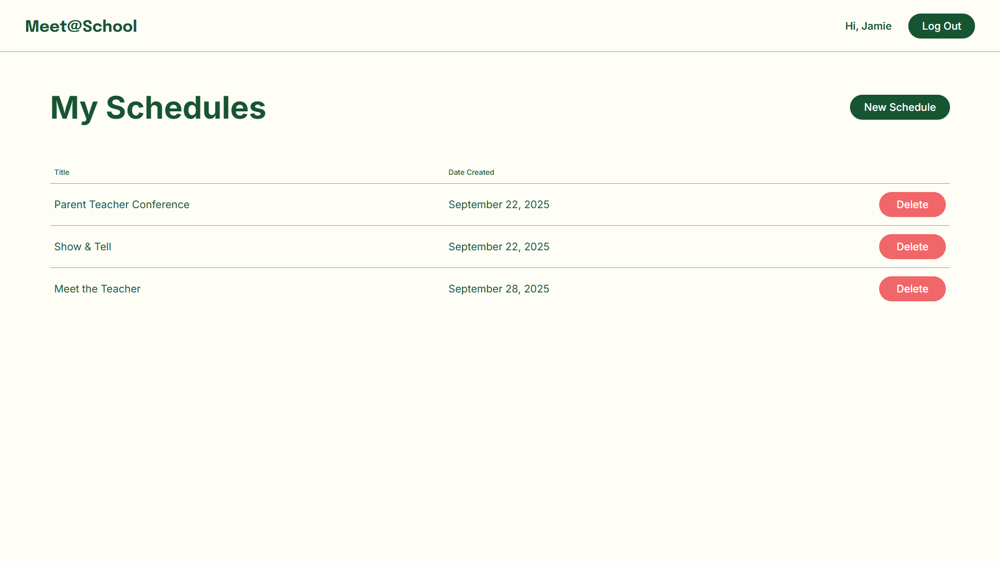
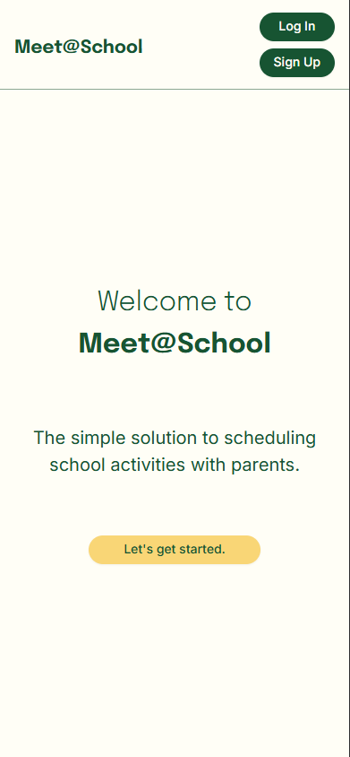
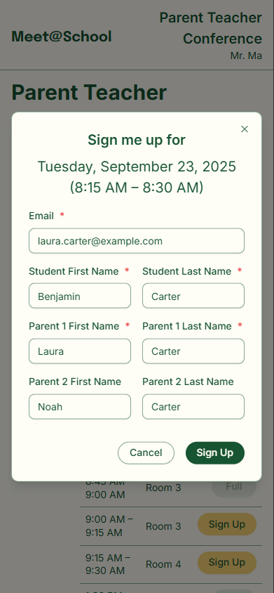
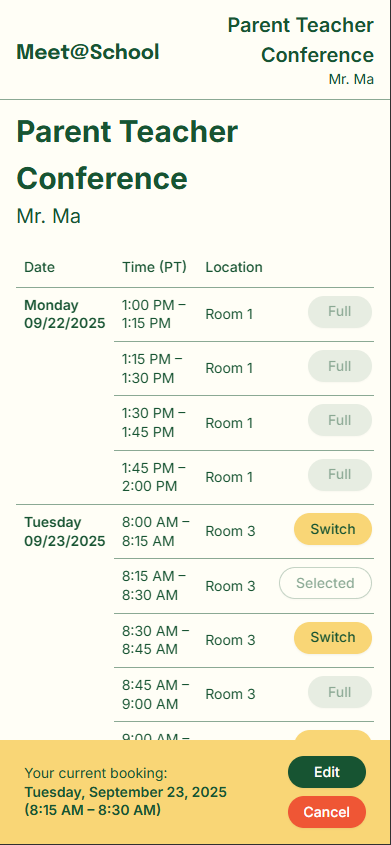
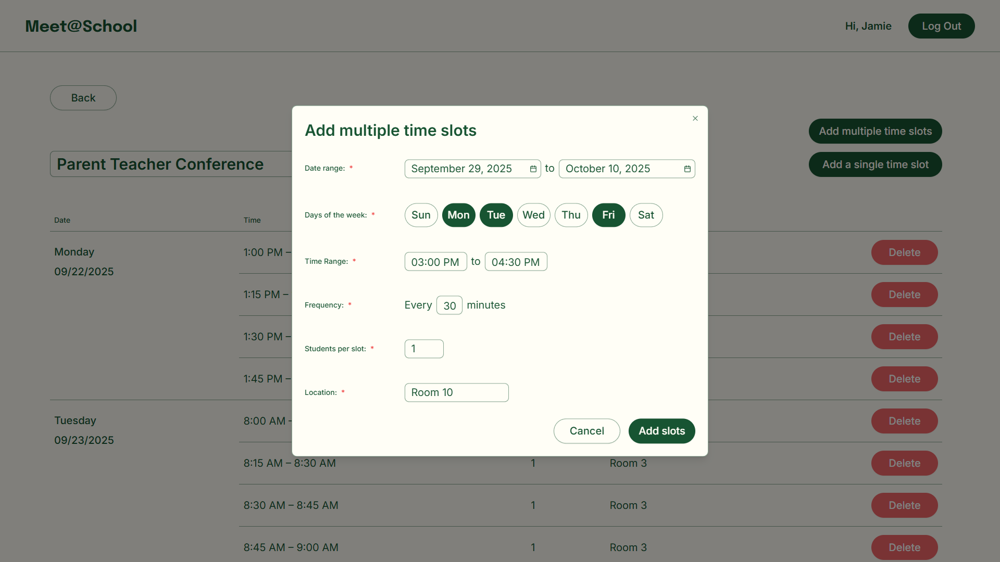
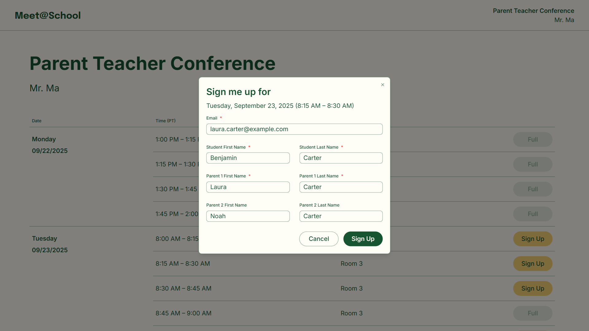
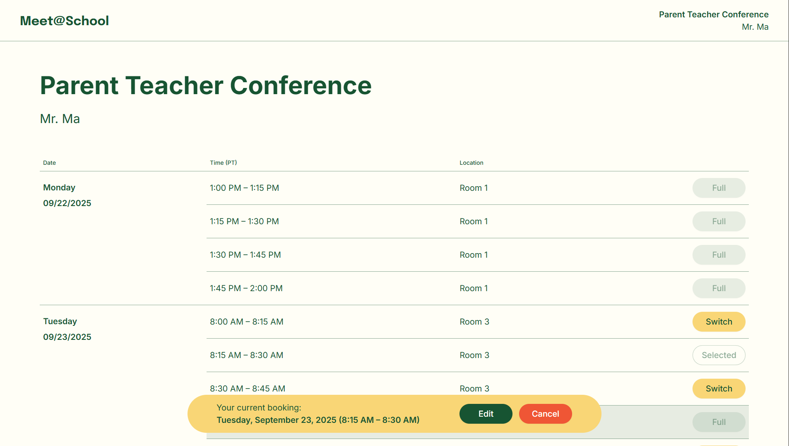
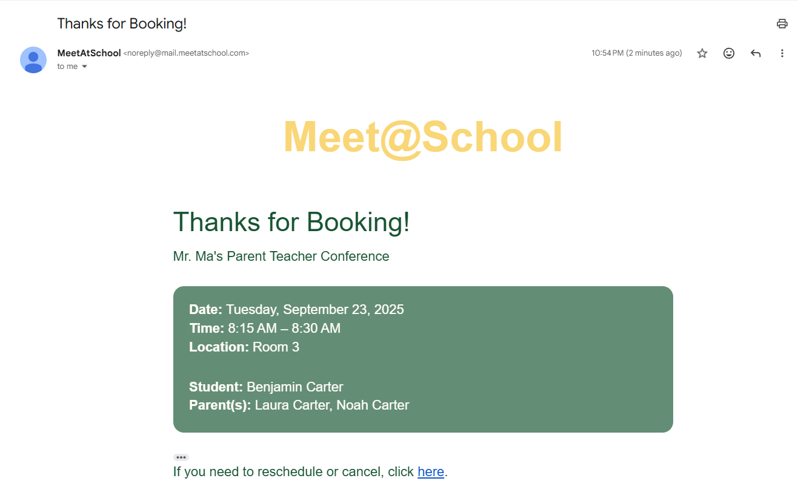

# Meet@School

Meet@School is a production scheduling app built to simplify conference and appointment booking for schools. It gives school staff a simple way to create and publish schedules, while giving families a public booking flow with confirmation, rescheduling, and cancellation support. The experience is designed for use across desktop and mobile.

> Source code is private because the app handles production accounts, family contact information, student names, booking links, and email workflows. This case study is the public-facing artifact for the project and is designed to show product and engineering ownership without exposing customer data or private implementation details.

## Demo

**[Visit the live app](https://www.meetatschool.com/)**

## Problem

School scheduling often depends on manual emails, spreadsheets, or paper sign-up sheets. That creates unnecessary coordination work for staff, makes availability harder for families to understand, and turns a simple operational workflow into repeated back-and-forth communication.

The product goal was to replace that friction with a self-serve scheduling flow that is easier for staff to manage and easier for families to use.

## Solution

Meet@School gives staff a private dashboard to create schedules, generate appointment slots, publish a shareable booking page, and review signups in one place. Families can open the public schedule, choose an available time, receive confirmation emails, and later edit, switch, or cancel a booking through their email link.

## Impact

- Used in production by 2 elementary school classrooms to coordinate parent-teacher conference scheduling.
- Supported scheduling for 40+ students through an end-to-end teacher and family workflow.
- Automated 100+ confirmation and booking-change emails, reducing manual back-and-forth communication for teachers.

## Core Product Workflow

1. A teacher signs in, creates a schedule, and gives it a title.
2. The teacher can add individual appointment slots or generate them in bulk across a date range, selected weekdays, time window, interval length, capacity, and location settings.
3. The teacher publishes the schedule and shares the public booking link with their class.
4. A family selects an available time slot and submits their booking information without needing to create an account.
5. A confirmation email is sent with booking details and a link the family can use later to edit, switch, or cancel the booking.
6. A reminder email is sent about 24 hours before the appointment to notify the family.
7. The teacher can continue updating the schedule by adding, editing, or deleting time slots, and can review signups from the dashboard as needed.

## Features

- Built a private teacher dashboard for creating, managing, and publishing schedules.
- Added public booking pages with shareable links and a no-account booking management flow for families.
- Implemented bulk slot generation by date range, weekday, time range, interval, capacity, and location.
- Added capacity-aware logic so full or past slots are visibly unavailable.
- Made slot availability easy to browse so families can see open times at a glance while full or past slots are clearly closed.
- Supported booking creation, edit, switch, and cancellation flows end to end.
- Used Next.js App Router to separate private teacher workflows from public booking routes.
- Used Supabase for authentication, data storage, and server-side access patterns across different app surfaces.
- Centralized validation with Zod and React Hook Form for scheduling and booking workflows.
- Integrated Resend for booking lifecycle emails and added a Supabase Edge Function for scheduled reminders.
- Built the interface to work cleanly across desktop and mobile.

## Mobile Experience

The public family-facing flow was designed to work cleanly on phones as well as desktop, reducing friction for families who prefer to complete booking and follow-up actions from a mobile device.

| Landing page | Booking flow | Manage booking |
| --- | --- | --- |
|  |  |  |

## Screenshots

Manage multiple schedules from the private teacher dashboard.

Generate appointment slots across date ranges, weekdays, time windows, and interval settings.

Families can book an appointment without creating an account.

Booked families can later edit, switch, or cancel their appointment from the booking link.

Each booking triggers a confirmation email with the appointment details and follow-up link.

## Tech Stack

- Next.js
- React
- TypeScript
- Supabase
- Resend
- Tailwind CSS
- Radix UI and shadcn/ui
- React Hook Form
- Zod
